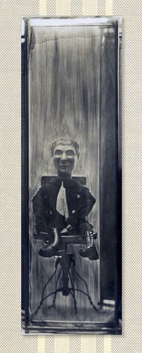

## poetry and old-time music

In my poetry life, I write poems, give readings, teach writing classes and workshops, and encourage poetry everywhere. I have three books,
*[The Cupboard Artist](/poems/books.html)* (Floating Bridge Press, 2012),
*[Now](/poems/books/html)*(Bear Star Press 2007), and
*[By A Thread](/poems/books/html)* (Van West & Company, 2000),
and my work appears in many journals and magazines.

 

 

In my music life, I play old-time banjo, fiddle and guitar.
I give banjo lessons, play for dances, concerts, and in living rooms,
and love to get together with friends who play.
My recordings are
*[Instead of a Pony](/music/index.html)*, and
*[Goose and Gander](/music/index.html)*.

## newsshshshshshshs

* New in 2016! Now offering banjo lessons at
  [Dusty Strings Music School](http://store.dustystrings.com/t-3-ms-PL-banjo.aspx?skinid=4)
  in Fremont as well as in my living room. Call or visit
  [Dusty Strings](http://store.dustystrings.com/t-3-ms-workshophome.aspx)
  to find out about lessons there.
  Click <a href="/music/banjo-lessons.html" rel="Text_Window">here</a> for
  information about my lessons and teaching philosophy.

* New poems out in the Winter 2014-15 issue of
  [Crab Creek Review](http://www.crabcreekreview.org/)!

* 
  Finally it's here, my new book! *Exercises to Free the Tongue*:
  poems and text by Molly Tenenbaum, artist's book by Ellen Ziegler,
  printing and binding by Paper Hammer. Illuminated with historic images
  and ephemera from Molly’s grandparents, ventriloquists on the vaudeville
  circuit in the early 1900s, this book of poems plays with ventriloquial
  metaphors of voice and breath. A long time in the works, this is a book to
  celebrate.

The artist's book is printed in a limited edition of 20 copies;
a less limited spiral-bound edition is also available, and you can even buy
it at the [store](/store/index.html).
5” x 13”, 42 pages. Click
[here](/poems/ExercisesExcerpts.html) to see more poems and pages from the book.

* November 5, 2014:
  [Book Launch Party for Exercises
  to Free The Tongue](https://www.facebook.com/events/825149020849455/)
  a limited-edition artist book of poems about my grandparents' lives as
  ventriloquists on the vaudeville stage in the early 1900s. 7pm at Richard
  Hugo House.

* Read my poem
  ["This Poem Needs Garlic"](http://www.tinderboxpoetry.com/this-poem-needs-garlic)
  in the new issue of
  [Tinderbox Poetry](http://www.tinderboxpoetry.com/this-poem-needs-garlic).

* New poems in the Summer/Fall 2014 issue of
  [Poetry Northwest](http://www.poetrynw.org/issue-cover/the-social-media-issue-2014/)!

* April 28, 2014: The collaborative book I'm working on about my family's
  history with ventriloquism is featured today on the
  [Best American Poetry Blog](http://blog.bestamericanpoetry.com/the_best_american_poetry/2014/04/molly-tenenbaum-poet-ellen-ziegler-artist--1.html),
  in an interview with
  [Martha Silano](http://bluepositive.blogspot.com/2014/04/guest-blogging-this-week-at-best.html).

* Check out my poem,
  "[Some Words](http://www.ecotonejournal.com/index.php/articles/details/some_words_acid_extinction_are_pasted_to_the_undersides_of_others)"
  in the Fall 2013 issue of
  [Ecotone](http://www.ecotonejournal.com/index.php/issues/toc/ecotone_16/).

* New poem of mine in the Fall 2013 issue of
  [The Southern Humanities Review](http://www.cla.auburn.edu/shr/)!

* The 30th Anniversary edition of the
  [Crab Creek Review](http://www.amazon.com/Crab-Creek-Review-Anniversary-Issue/dp/1490487107)
  is out. I'm proud to be included.

* Check out this wonderful new anthology,
  [live at the Center: Contemporary Poems from the Pacific Northwest](http://ooligan.pdx.edu/poetry/alive-at-the-center/)!
  Read my poem, "[Bloomery](/poems/Bloomery.html),"
  which I'm honored is included.

* Read this
  [review](http://www.ronslate.com/seventeen_poets_recommend_new_recent_titles) of my  book,
  *[The Cupboard Artist](http://www.scn.org/floatingbridge/cupboard.html)*.

* Climb
  ["The Apple Ladder"](http://kathleenflenniken.com/blog/?p=167),
  my poem in
  [The Far Field](http://kathleenflenniken.com/blog/), our
  Washington State Poet Laureate's blog of Washington State Poets and Poetry.

* Read my poem
  ["Afternoon Off"](http://www.poetrynw.org/2012/01/molly-tenenbaum-afternoon-off/)
  in *Poetry Northwest*.

* *[Fire on Her Tongue](http://twosylviaspress.com/fire-on-her-tongue.html)*,
  e-anthology of contemporary poems by women, is available from
  [Two Sylvias Press!](http://twosylviaspress.com/fire-on-her-tongue.html)
  Contains poems not only by me, but also by Kim Addonizio, Dorianne Laux,
  Martha Silano, Patricia Smith, Nance Van Winkel, and many other fine
  poets. I'm thrilled that my poem
  ["The Pillows"](/poems/ThePillows.html) is included!

* And how about this incredible anthology of contemporary persona poems,
  [A Face to Meet the Faces](http://www.uakron.edu/uapress/browse-books/book-details/index.dot?id=2337015)?
  In it you'll find impersonations of Icarus, Diana Ross, Robert
  Oppenheimer, and many others, including my own, of Julia Child, inspired
  by her
  [kitchen](http://amhistory.si.edu/juliachild/) at the
  Smithsonian.

* Check out my poem
  [My New Library](http://anti-poetry.com/anti/tenenbaummo/),
  in issue #9 of *Anti-*, a journal of contrarian poems.

* Read
  [three insomniac poems](http://www.fringemagazine.org/lit/poetry/my-flannel-civilization-and-two-more-poems/)
  in *[Fringe](http://www.fringemagazine.org/)* magazine.

* Look, my poem "I Live in a Yellow Ice Cream Truck" has prompted an
  [artistic response](http://delirioushem.blogspot.com/2009/09/anna-lena-phillips-boots-bottles.html)
  from he magnificently creative Anna Lena Phillips!

* 
  My recent banjo CD, **Goose and Gander** features me on banjo and vocals,
  and my brother Dan Tenenbaum on guitar. Here's "Bowling Green": 
  

  <audio controls>
  <source src='/uploads/mp3/01 Bowling Green.mp3'>
  Your browser does not support the audio element.
  Please use an HTML5-compatible browser.
  </audio>
  

* Praise for *Goose and Gander* from
  [Bill Martin's weekly Portland newsletter](http://www.bubbaguitar.com/newsletter.html):
  "Molly Tenenbaum's "Goose
  and Gander" is another superb channeling. In particular,
  "Old Kimball" makes my socks roll up and down in a terrible frenzy."
  "...fresh and alive, brilliantly played and innovative within the style. It
  takes a high degree of artistry and discipline to express yourself within a
  style of music and not mutilate it."